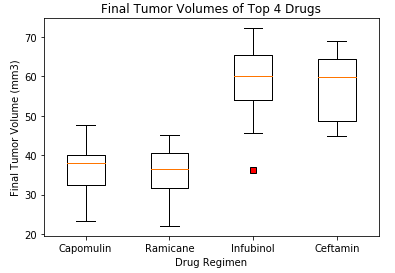
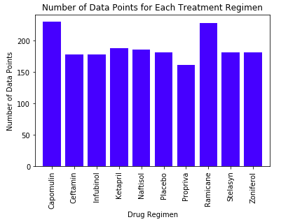
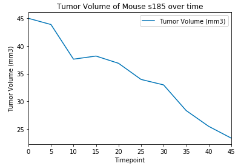

# Matplotlib Homework - The Power of Plots #

## Background ##
What good is data without a good plot to tell the story?
So, let's take what you've learned about Python Matplotlib and apply it to a real-world situation and dataset:

While your data companions rushed off to jobs in finance and government, you remained adamant that science was the way for you. Staying true to your mission, you've joined Pymaceuticals Inc., a burgeoning pharmaceutical company based out of San Diego. Pymaceuticals specializes in anti-cancer pharmaceuticals. In its most recent efforts, it began screening for potential treatments for squamous cell carcinoma (SCC), a commonly occurring form of skin cancer.

As a senior data analyst at the company, you've been given access to the complete data from their most recent animal study. In this study, 250 mice identified with SCC tumor growth were treated through a variety of drug regimens. Over the course of 45 days, tumor development was observed and measured. The purpose of this study was to compare the performance of Pymaceuticals' drug of interest, Capomulin, versus the other treatment regimens. You have been tasked by the executive team to generate all of the tables and figures needed for the technical report of the study. The executive team also has asked for a top-level summary of the study results.

## Observations and Analysis ##

Capomulin and Ramicane had the two smallest average final tumor volumes of the drugs included in the trials, which would indicate that these two drugs were the most effective at reducing tumors. Furthermore, these two regimens also had the greatest number of data points, so the reduced tumor volume was replicated among multiple mice. However, since we looked only at final tumor volumes, it's possible that these mice had smaller tumor volumes at the beginning of the trials. 

Mouse weight and tumor volume were strongly positively correlated, at least for the mice in the Capomulin trial. We can estimate that an increase of 1g of weight in the mouse will correspond to an increase of about 0.95mm3 in tumor volume.

Capomulin was effective in shrinking the tumor volume of mouse s185  by about half, from 45 mm3 at the start of the study to 23.3mm3 at the end of the study.

